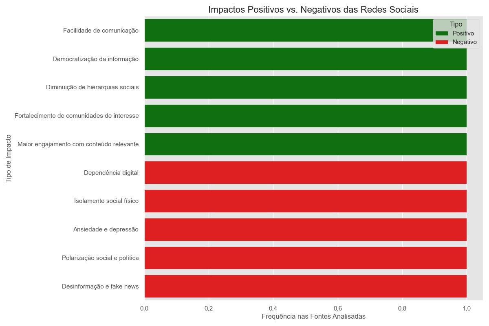
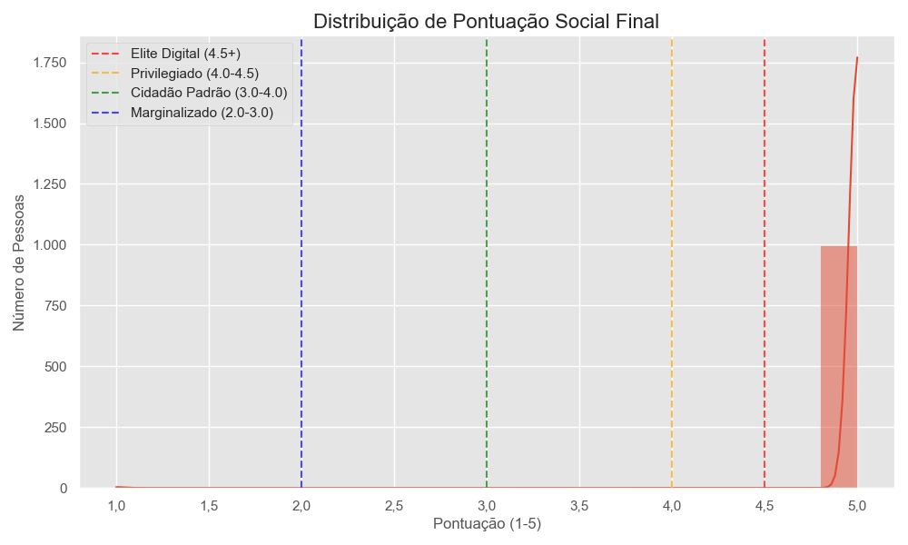
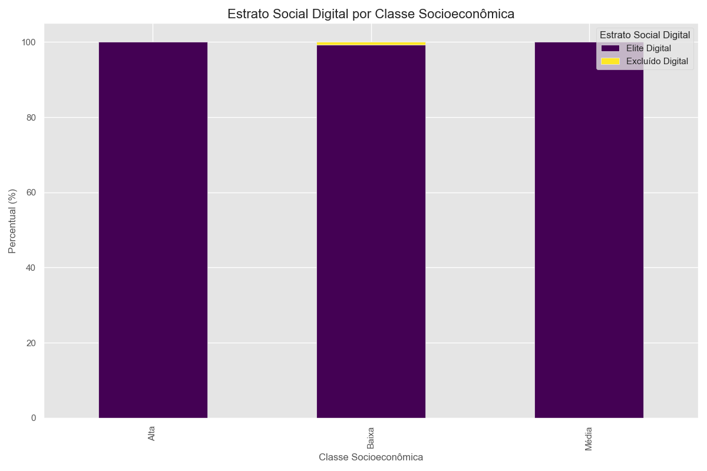
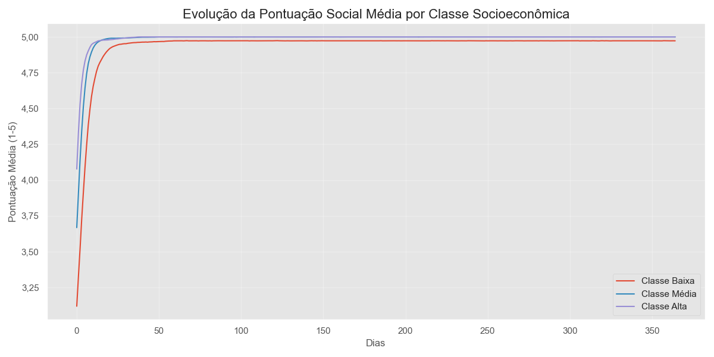
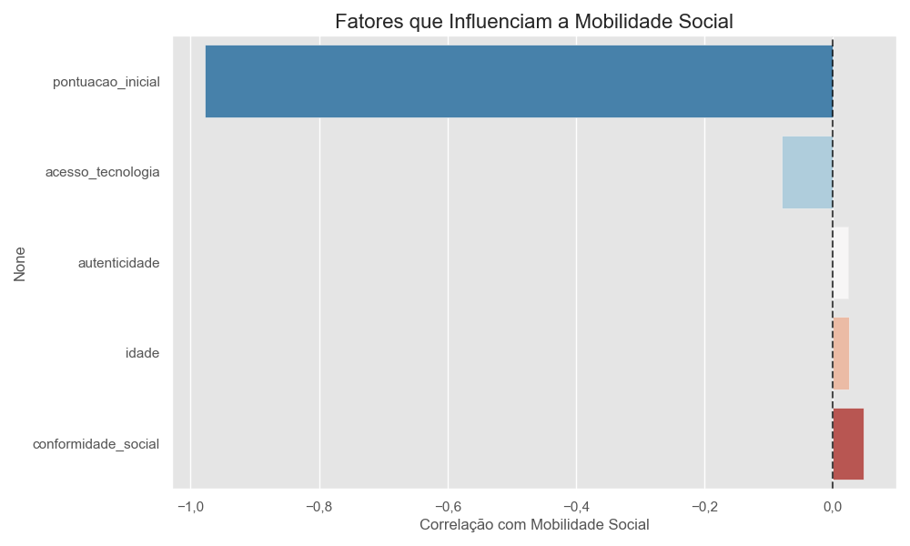

#  SocialDive Analytics

## Análise do Impacto Social das Redes Sociais e Simulação de Cenários Futuros

##  Sobre o Projeto

O **Projeto SocialDive Analytics** é uma análise aprofundada do impacto social das redes sociais na sociedade contemporânea, combinada com uma simulação de cenários futuros inspirados no episódio "NoseDive" da série Black Mirror. Este projeto integra análises qualitativas de artigos acadêmicos com simulações quantitativas para explorar como sistemas de pontuação social podem afetar a estratificação e mobilidade social.

##  Metodologia

O projeto combina duas abordagens metodológicas:

1. **Análise Qualitativa**: Extração e análise de conceitos-chave, impactos positivos e negativos de quatro artigos acadêmicos sobre redes sociais e seu impacto na sociedade.

2. **Simulação Quantitativa**: Desenvolvimento de um modelo computacional que simula uma sociedade baseada em pontuação social, considerando fatores como classe socioeconômica, nível educacional, conformidade social e acesso à tecnologia.

##  Visualizações e Resultados

### 1. Impactos Positivos vs. Negativos das Redes Sociais

Este gráfico compara os impactos positivos e negativos das redes sociais identificados na literatura acadêmica. Os impactos positivos (em verde) incluem democratização da informação e novas formas de mobilização social, enquanto os negativos (em vermelho) incluem polarização, dependência digital e superficialidade nas relações.

### 2. Distribuição de Pontuação Social Final

Esta visualização mostra como a pontuação social se distribui na população simulada após um ano de evolução. As linhas verticais demarcam os diferentes estratos sociais:
- **Elite Digital** (4.5+): A camada mais privilegiada da sociedade digital
- **Privilegiado** (4.0-4.5): Indivíduos com alto status social digital
- **Cidadão Padrão** (3.0-4.0): A maioria da população
- **Marginalizado** (2.0-3.0): Pessoas com baixo status social digital
- **Excluído Digital** (abaixo de 2.0): Indivíduos praticamente invisíveis no sistema

### 3. Estrato Social Digital por Classe Socioeconômica

Este gráfico de barras empilhadas mostra a relação entre a classe socioeconômica inicial e o estrato social digital final. Observa-se que pessoas de classes socioeconômicas mais altas têm maior probabilidade de alcançar estratos digitais superiores, evidenciando como desigualdades existentes tendem a se reproduzir no ambiente digital.

### 4. Evolução da Pontuação Social por Classe Socioeconômica

Esta visualização temporal mostra como a pontuação social média evolui ao longo de um ano para diferentes classes socioeconômicas. Observa-se uma divergência crescente entre as classes, ilustrando o "Efeito Mateus" digital (rico fica mais rico, pobre fica mais pobre).

### 5. Mobilidade Social por Classe Socioeconômica

Este gráfico de caixas (boxplot) mostra a variação na pontuação social (mobilidade) para cada classe socioeconômica. Classes mais altas tendem a apresentar mobilidade positiva, enquanto classes mais baixas frequentemente experimentam mobilidade negativa ou estagnação.

### 6. Fatores que Influenciam a Mobilidade Social

Este gráfico de barras mostra a correlação entre diferentes características individuais e a mobilidade social. Fatores como acesso à tecnologia e conformidade social apresentam correlação positiva com mobilidade ascendente, enquanto a pontuação inicial alta pode limitar o potencial de crescimento adicional.

##  Principais Conclusões

1. **Reprodução de Desigualdades**: A estratificação social digital tende a reproduzir e amplificar desigualdades socioeconômicas existentes.

2. **Determinantes da Mobilidade**: O acesso à tecnologia e o nível educacional são fatores determinantes para a mobilidade social em um sistema de pontuação.

3. **Conformidade vs. Autenticidade**: Pessoas com maior conformidade social tendem a se beneficiar mais em sistemas de pontuação, enquanto a autenticidade pode ser penalizada.

4. **Câmaras de Eco**: A formação de bolhas sociais é um fenômeno natural em redes baseadas em pontuação, reforçando a polarização.

5. **Efeito Mateus Digital**: Observa-se que "o rico fica mais rico, o pobre fica mais pobre" na evolução das pontuações ao longo do tempo.

6. **Barreiras à Mobilidade**: A mobilidade social ascendente é mais difícil para classes socioeconômicas mais baixas, criando um ciclo de exclusão digital.

## Implicações Éticas e Sociais

- **Erosão da privacidade**: Sistemas de pontuação social requerem vigilância constante das ações individuais.
- **Conformismo excessivo**: Pessoas podem sacrificar autenticidade e pensamento crítico para maximizar pontuação.
- **Discriminação algorítmica**: Vieses nos algoritmos podem perpetuar e amplificar desigualdades existentes.
- **Exclusão digital**: Pessoas sem acesso adequado à tecnologia ficam cada vez mais marginalizadas.
- **Saúde mental**: Ansiedade, depressão e outros problemas podem surgir da pressão constante por aprovação social.
- **Manipulação comportamental**: O sistema pode ser usado como ferramenta de controle social e político.

##  Referências

1. [O efeito da rede social em nosso cotidiano](https://meuartigo.brasilescola.uol.com.br/sociologia/o-efeito-rede-social-nosso-cotidiano.htm) - Brasil Escola
2. [Echo Chambers on Social Media: A comparative analysis](https://arxiv.org/abs/2004.09603) - arXiv
3. [Sociedade em rede](https://pt.wikipedia.org/wiki/Sociedade_em_rede) - Wikipedia
4. [Da Rede para a Sociedade](https://www.eumed.net/rev/cccss/2017/01/redes.html) - Eumed

---

